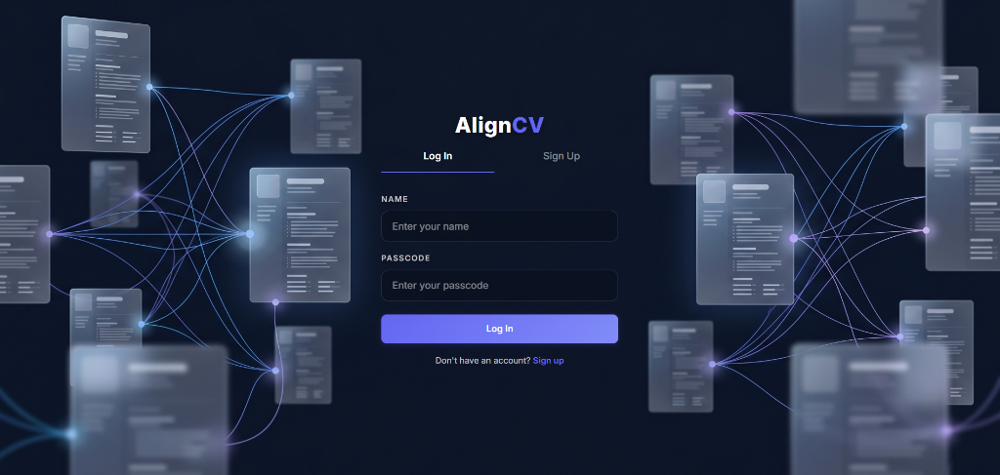
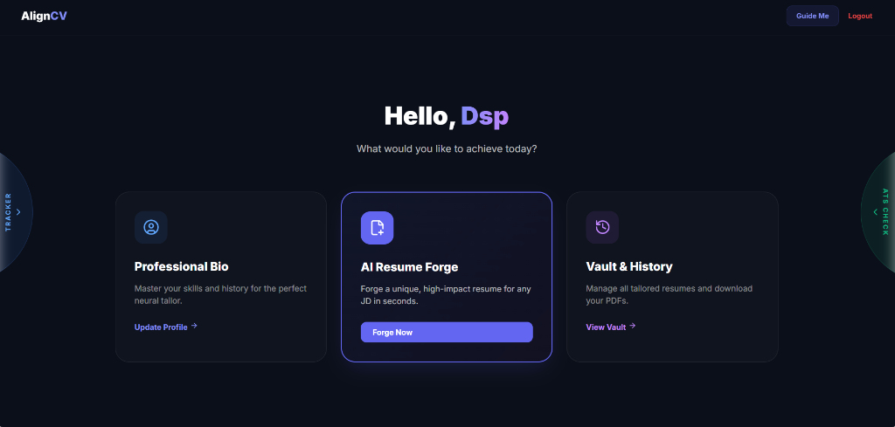

<p align="center">
  
</p>

<h1 align="center">AlignCV</h1>

<p align="center">
  <strong>An intelligent, multi-model resume tailoring system that aligns candidate profiles with job descriptions through automated content selection, bullet-point rewriting, and ATS-optimized PDF generation.</strong>
</p>

<p align="center">
  <a href="#overview">Overview</a> &middot;
  <a href="#key-features">Features</a> &middot;
  <a href="#technical-architecture">Architecture</a> &middot;
  <a href="#methodology">Methodology</a> &middot;
  <a href="#results--demonstration">Results</a> &middot;
  <a href="#installation--setup">Setup</a> &middot;
  <a href="#technologies--tools">Stack</a> &middot;
  <a href="#license">License</a>
</p>

---

## Overview

AlignCV is a full-stack, AI-driven platform that automates the process of tailoring technical resumes to specific job descriptions. The system ingests a candidate's complete career profile — education, work experience, projects, skills, certifications, and achievements — and produces a one-page, ATS-optimized PDF resume that is contextually aligned with a target position.

The core pipeline employs eight specialized large language model (LLM) prompts orchestrated through a fault-tolerant, multi-provider AI router that distributes inference requests across Groq, Cerebras, and Google AI Studio with automatic key rotation and provider-level fallback. The system performs four sequential inference passes: relevance-based content selection, keyword-aligned bullet-point rewriting, professional summary generation, and template-driven PDF rendering via headless Chromium.

Post-generation, the platform provides an interactive editor with three integrated analysis tools: an ATS scoring simulator with weighted five-category breakdowns, a skill gap detection engine with quantified ATS-boost estimates, and a conversational AI assistant that supports iterative resume refinement through a diff-preview workflow modeled after modern code-review interfaces.

---

## Key Features

- **Multi-Step AI Tailoring Pipeline** — Four-pass inference pipeline that selects, scores, rewrites, and formats resume content against a parsed job description.
- **Multi-Provider AI Router** — Distributes inference across Groq (Llama 3.3 70B), Cerebras (Llama 3.1 8B), and Google AI Studio (Gemini 2.0 Flash) with round-robin key rotation and automatic 429-based cooldown management.
- **ATS Scoring Engine** — Simulates Applicant Tracking System evaluation across five weighted categories: keyword match (35%), skills match (25%), experience relevance (20%), section completeness (10%), and format compliance (10%).
- **Skill Gap Detection** — Identifies missing competencies relative to the job description and estimates per-skill ATS score improvements.
- **Conversational Resume Editor** — Natural-language editing interface with diff-preview and accept/reject workflow for controlled, auditable changes.
- **Resume PDF Generation** — Handlebars-based template engine rendering to Letter-format PDF via Puppeteer with Computer Modern Serif typography.
- **Profile Ingestion** — Automated PDF resume parsing into a normalized seven-section data model with robust date, URL, and type sanitization.
- **Application Tracker** — Integrated submission logging with resume-to-company linkage.
- **Interactive Onboarding** — Six-step guided tour for first-time users with progressive UI highlighting.

---

## Technical Architecture

The system follows a layered client-server architecture with clear separation between the presentation layer, API layer, service/business logic layer, and data access layer.

```
┌──────────────────────────────────────────────────────────────────────┐
│                      FRONTEND  (Vite + React 19)                     │
│                                                                      │
│   AuthPage ─── DashboardPage ─── ProfilePage ─── NewResumePage       │
│                                   ProfileWizard    EditorPage        │
│                                   PreviewProfile   HistoryPage       │
│                                                                      │
│   State: Zustand (authStore, profileStore, resumeStore)              │
│   HTTP:  Axios with JWT interceptor                                  │
│   UI:    Inline styles + TailwindCSS 4, Lucide icons, Recharts       │
├──────────────────────────────────────────────────────────────────────┤
│                          REST API  (Express 4)                       │
│                                                                      │
│   /api/auth     /api/profile   /api/jd       /api/resume             │
│   /api/ats      /api/skillgap  /api/chat     /api/tracker            │
│                                                                      │
│   Middleware: Helmet, CORS, Compression, Rate Limiting, Zod, JWT     │
├──────────────────────────────────────────────────────────────────────┤
│                       SERVICE LAYER  (Node.js)                       │
│                                                                      │
│   aiRouter.js ────── nimService.js (8 prompts)                       │
│   tailorService.js ─ profileService.js ─ templateService.js          │
│   exportService.js ─ authService.js ──── uploadService.js            │
├──────────────────────────────────────────────────────────────────────┤
│                      DATA ACCESS  (Knex.js + PostgreSQL)             │
│                                                                      │
│   11 query modules ── 14 migrations ── 10 tables                     │
│   Connection: Supabase PostgreSQL with SSL                           │
├──────────────────────────────────────────────────────────────────────┤
│                      EXTERNAL SERVICES                               │
│                                                                      │
│   Groq API ─── Cerebras API ─── Google AI Studio API                 │
│   Puppeteer (Headless Chromium) ─── resume.lol font CDN              │
└──────────────────────────────────────────────────────────────────────┘
```

### AI Router Design

The AI router implements a task-aware, multi-provider dispatch system. Each of the eight inference tasks maps to a prioritized provider ordering. On invocation, the router attempts the preferred provider first, rotating through available API keys. If a 429 (rate limit) response is received, the specific key is placed on a timed cooldown derived from the provider's `Retry-After` header, and the router advances to the next available key or provider.

```
Task Request
    │
    ▼
┌─────────────────────────┐
│   Task-Provider Map     │     parse_resume_pdf  → [groq, cerebras, google]
│   (TASK_ROUTES)         │     rewrite_bullets   → [cerebras, groq, google]
└────────┬────────────────┘     ats_score          → [cerebras, groq, google]
         │
         ▼
┌─────────────────────────┐
│   Key Rotation          │     Round-robin across N keys per provider
│   + Cooldown Check      │     Cooldown = Retry-After + 2s buffer
└────────┬────────────────┘
         │
         ▼
┌─────────────────────────┐
│   OpenAI-Compatible     │     POST /chat/completions
│   API Call              │     response_format: json_object (where supported)
└────────┬────────────────┘
         │
         ▼
┌─────────────────────────┐
│   JSON Extraction       │     Balanced-brace parser for malformed responses
│   + Validation          │     Strips markdown fences, finds first valid object
└─────────────────────────┘
```

---

## Methodology

### 1. Profile Ingestion and Normalization

Users provide career data either through manual form entry or by uploading an existing resume in PDF format. For PDF uploads, the system extracts raw text using `pdf-parse` (operating entirely in-memory to avoid filesystem overhead), then passes the text through a structured-extraction prompt (`parseResumePDF`) that produces a normalized JSON object conforming to a seven-section schema: personal information, education, experiences, projects, skills, achievements, and certifications.

The parsed output undergoes programmatic sanitization:
- **Date normalization** — Handles heterogeneous formats ("November 2022", "2019", "Present") with fallback to year-only extraction.
- **URL cleaning** — Ensures proper protocol prefixes for GitHub, LinkedIn, and portfolio links.
- **Type enforcement** — Experience types are constrained to `{job, internship, freelance}`.
- **Array normalization** — Bullets and tech stacks are guaranteed as arrays regardless of source format.
- **CGPA extraction** — Parses decimal patterns from freeform strings (e.g., "3.8/4.0" yields `3.8`).

### 2. Job Description Analysis

The target job description is processed by the `analyseJD` prompt, which extracts structured hiring signals:

| Field | Description |
|-------|-------------|
| `role_title` | Canonical position title |
| `company_name` | Hiring organization |
| `required_skills` | Non-negotiable competencies |
| `preferred_skills` | Optional but valued competencies |
| `keywords` | Domain-specific terminology for ATS matching |
| `seniority` | `fresher`, `junior`, `mid`, or `senior` |
| `domain` | `frontend`, `backend`, `fullstack`, `ml`, `devops`, `data`, `mobile`, `other` |
| `key_responsibilities` | Core role functions |
| `tech_stack` | Specific technologies mentioned |

### 3. Relevance Scoring and Content Selection

The `scoreAndRankProfile` prompt receives a slim projection of the user's projects and experiences alongside the JD analysis. Each item is scored on a 0--100 relevance scale. The system selects the top two projects and top two experiences for inclusion on the one-page resume, with justification text for each selection.

A graceful fallback ensures that if the scoring inference fails or returns malformed output, the system defaults to selecting the first two items in each category.

### 4. Bullet-Point Rewriting

Selected items are passed to the `rewriteBullets` prompt with the following constraints:
- Exactly two bullets per item (enforced at the prompt level).
- 30--45 words per bullet to achieve approximately three typeset lines.
- Strong action verbs with quantifiable impact where the source data supports it.
- Natural injection of JD keywords without fabricating metrics or achievements.
- Strict preservation of original facts, technical stacks, and methodologies.

### 5. Professional Summary Generation

The `generateSummary` prompt synthesizes a three-line executive foreword (55--70 words) that bridges the candidate's top achievements with the specific job requirements. The summary is constrained to use only information physically present in the user's profile data.

### 6. Template Rendering and PDF Export

The final resume is rendered through a Handlebars HTML template modeled after the Jake Ryan resume format — a widely recognized ATS-compatible layout. The template uses Computer Modern Serif typography loaded from a CDN, providing a LaTeX-like typographic aesthetic.

Key rendering steps:
1. **Skill grouping** — Skills are organized by category with deterministic ordering (Languages > Frameworks > Libraries > Cloud & Databases > Developer Tools > Other).
2. **Date formatting** — ISO dates are converted to "Month Year" display format.
3. **Conditional sections** — Empty sections are suppressed.
4. **HTML generation** — Handlebars compiles the context into a complete HTML document.
5. **PDF conversion** — Puppeteer launches a headless Chromium instance, loads the HTML with `networkidle0` wait (for font loading), and exports to Letter-format PDF with 0.5-inch margins.

---

## Results and Demonstration

<p align="center">
  
</p>

<p align="center"><em>Figure 1: Authentication interface. The login view presents a streamlined name-and-passcode credential system overlaid on a generative background depicting interconnected resume documents, visually representing the platform's document-intelligence capabilities.</em></p>

<br/>

<p align="center">
  
</p>

<p align="center"><em>Figure 2: Primary dashboard. The central command surface exposes three primary workflows — profile management ("Professional Bio"), job-description-driven resume generation ("AI Resume Forge"), and historical resume retrieval ("Vault & History"). Lateral drawers provide access to the Application Tracker (left) and the standalone ATS Validator (right).</em></p>

---

## Current Achievements

| Metric | Value |
|--------|-------|
| AI Prompts in Pipeline | 8 specialized inference tasks |
| AI Providers Supported | 3 (Groq, Cerebras, Google AI Studio) |
| Database Migrations | 14 migration files across 10 tables |
| Frontend Pages | 8 lazy-loaded route components |
| Profile Sections | 7 (personal, education, experience, projects, skills, achievements, certifications) |
| Resume Template | Jake Ryan format, Computer Modern Serif, ATS-optimized |
| PDF Output Format | US Letter (8.5 x 11 in), 0.5 in margins |
| ATS Scoring Categories | 5-category weighted evaluation (0--100 scale) |
| Authentication | JWT-based with bcrypt hashing (10 rounds, 7-day expiry) |
| Rate Limit Tiers | 4 (AI: 10/min, Auth: 20/min, Export: 5/min, Default: 100/min) |

---

## Challenges and Limitations

- **LLM Output Variability** — Despite structured prompts and `response_format: json_object` enforcement, provider responses occasionally require fallback to a balanced-brace JSON extraction heuristic. This introduces a non-zero parsing failure rate, particularly with the Google AI Studio provider which does not fully support the OpenAI JSON mode specification.

- **Single-Page Constraint** — The current pipeline optimizes for one-page resumes. Candidates with extensive experience (10+ years) may find that the two-project, two-experience selection is overly restrictive. Extending to multi-page layouts with dynamic section allocation is an open design problem.

- **Rate Limit Throughput** — Free-tier API keys impose strict rate limits. Under concurrent usage, the key rotation system mitigates but does not eliminate request queuing delays. Production deployments require paid API tiers or self-hosted model endpoints.

- **PDF Rendering Dependency** — Puppeteer requires a full Chromium installation, increasing deployment image size on containerized platforms. Chromium compatibility on restricted environments (e.g., Render free tier) requires specific build flags and cache configuration.

- **No Semantic Diff Rendering** — The current diff-preview system applies inline HTML highlighting at the string level. It does not perform semantic-level diffing (e.g., understanding that "Developed" was replaced by "Architected" as a verb substitution).

---

## Future Work

- **Multi-Page Resume Support** — Dynamic section allocation based on profile density and JD complexity, with automatic page-break optimization.
- **Template Library** — Support for multiple resume templates selectable by the user, including column-based and design-focused layouts.
- **Self-Hosted Model Endpoint** — Integration with locally-deployed models via Ollama or vLLM to eliminate external API dependencies.
- **Collaborative Editing** — Real-time multi-user review and annotation on generated resumes.
- **Cover Letter Generation** — Extending the AI pipeline to produce role-aligned cover letters from the same profile and JD inputs.
- **Analytics Dashboard** — Longitudinal tracking of ATS scores across resume versions and job applications with trend visualization.
- **LinkedIn Import** — Automated profile ingestion via LinkedIn public profile parsing.
- **Internationalization** — Template and prompt localization for non-English job markets.

---

## Installation and Setup

### Prerequisites

- Node.js >= 18.x
- PostgreSQL >= 14.x (or a Supabase project)
- At least one API key from Groq, Cerebras, or Google AI Studio

### 1. Clone the Repository

```bash
git clone https://github.com/your-username/AlignCV.git
cd AlignCV
```

### 2. Configure Environment Variables

```bash
cp .env.example .env
```

Edit `.env` with your credentials:

```env
# Server
PORT=5000
NODE_ENV=development

# Database
DB_HOST=127.0.0.1
DB_PORT=5432
DB_NAME=aligncv
DB_USER=postgres
DB_PASSWORD=your_password

# Authentication
JWT_SECRET=your_jwt_secret
JWT_EXPIRES_IN=7d

# AI Providers (comma-separated for multiple keys)
GROQ_API_KEYS=gsk_key1,gsk_key2
CEREBRAS_API_KEYS=csk_key1
GOOGLE_AI_KEYS=AIza_key1

# Frontend URL (for CORS)
CLIENT_URL=http://localhost:3000
```

### 3. Install Dependencies

```bash
# Root (concurrently)
npm install

# Server
cd server && npm install

# Client
cd ../client && npm install
```

### 4. Run Database Migrations

```bash
npm run migrate
```

### 5. Start Development Servers

```bash
npm run dev
```

This launches both the Express API server (port 5000) and the Vite development server (port 3000) concurrently.

### Production Deployment

| Component | Platform | Command |
|-----------|----------|---------|
| Frontend | Vercel | `cd client && npm run build` (auto-deployed via Git) |
| Backend | Render | `cd server && npm run start:prod` (runs migrations, then starts) |
| Database | Supabase | Managed PostgreSQL with `DATABASE_URL` connection string |

---

## Technologies and Tools

### Frontend

| Technology | Version | Purpose |
|-----------|---------|---------|
| React | 19.2 | Component-based UI framework |
| Vite | 8.0 | Build tool and development server |
| TailwindCSS | 4.2 | Utility-first CSS framework |
| Zustand | 5.0 | Lightweight state management |
| React Router | 7.14 | Client-side routing |
| Axios | 1.15 | HTTP client with interceptors |
| Lucide React | 1.11 | Icon library |
| Recharts | 3.8 | Data visualization |
| Monaco Editor | 4.7 | Code/text editor component |
| react-hot-toast | 2.6 | Notification system |

### Backend

| Technology | Version | Purpose |
|-----------|---------|---------|
| Express | 4.21 | HTTP server framework |
| Knex.js | 3.1 | SQL query builder and migration runner |
| PostgreSQL (pg) | 8.12 | Database driver |
| Puppeteer | 23.4 | Headless Chromium for PDF generation |
| Handlebars | 4.7 | HTML template engine |
| jsonwebtoken | 9.0 | JWT authentication |
| bcryptjs | 2.4 | Password hashing |
| Zod | 3.23 | Request schema validation |
| Helmet | 7.1 | HTTP security headers |
| Winston | 3.14 | Structured logging |
| Multer | 1.4 | Multipart file upload handling |
| pdf-parse | 1.1 | PDF text extraction |
| diff | 9.0 | Text differencing for preview system |

### AI Providers

| Provider | Model | Context | Use Case |
|----------|-------|---------|----------|
| Groq | Llama 3.3 70B Versatile | 128K tokens | Primary inference for parsing, analysis, and chat |
| Cerebras | Llama 3.1 8B | 8K tokens | Fast inference for scoring, ranking, and ATS |
| Google AI Studio | Gemini 2.0 Flash | 1M tokens | Fallback provider |

### Infrastructure

| Service | Role |
|---------|------|
| Vercel | Frontend hosting (static SPA) |
| Render | Backend hosting (Node.js) |
| Supabase | Managed PostgreSQL database |

---

## Contributors

| Name | Role |
|------|------|
| Devi Sri Prasad | Author and Lead Developer |

---

## References

1. Ryan, J. (2023). *Jake's Resume Template*. A widely adopted single-column LaTeX resume format optimized for ATS compatibility.
2. Meta AI. (2024). *Llama 3.1 and 3.3: Open Foundation Models*. Technical reports on the Llama family of large language models.
3. Google DeepMind. (2024). *Gemini 2.0 Flash: Efficient Multimodal Reasoning*. Technical overview of the Gemini model architecture.
4. Puppeteer Contributors. (2024). *Puppeteer: Headless Chrome Node.js API*. https://pptr.dev
5. Knex.js Contributors. (2024). *Knex.js: SQL Query Builder for Node.js*. https://knexjs.org

---

## License

This project is distributed under the [MIT License](LICENSE).

---

<p align="center">
  <sub>Built with structured inference, deterministic rendering, and a commitment to honest resume generation.</sub>
</p>
